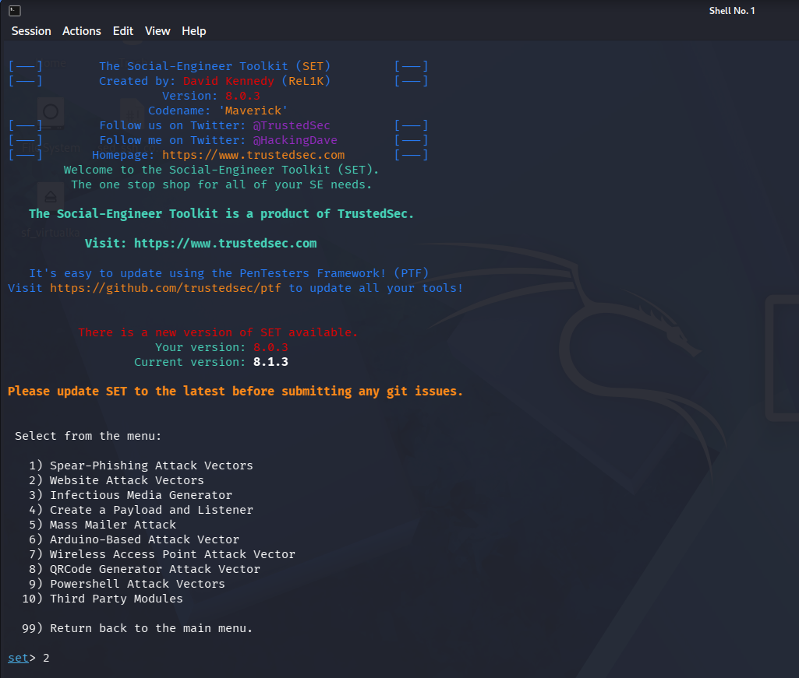
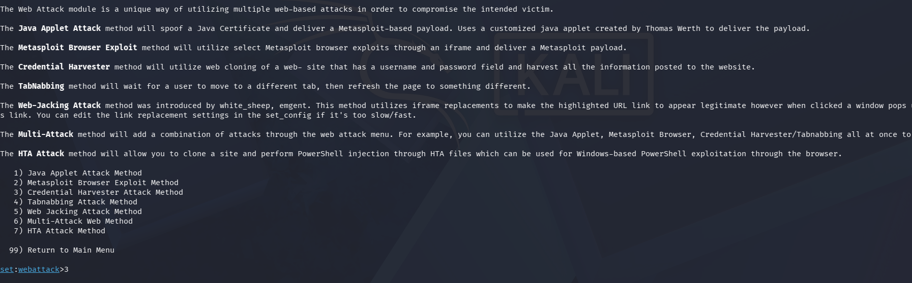
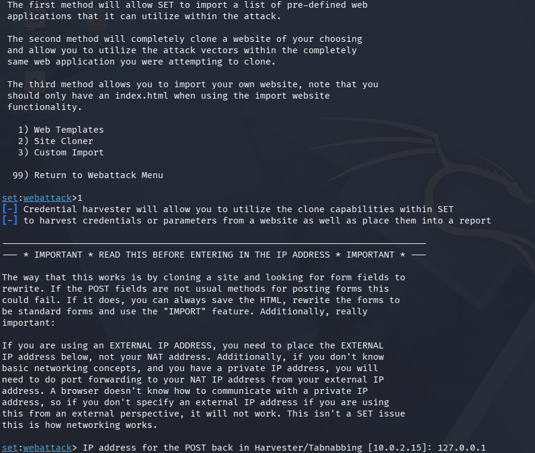
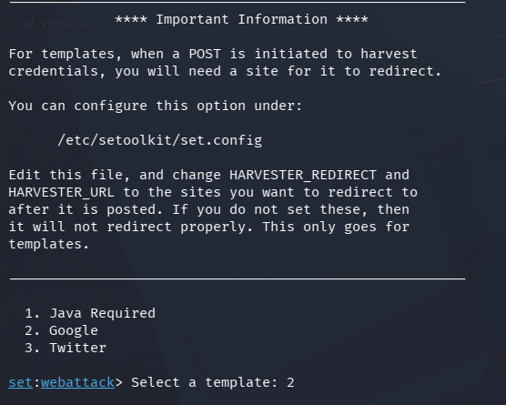
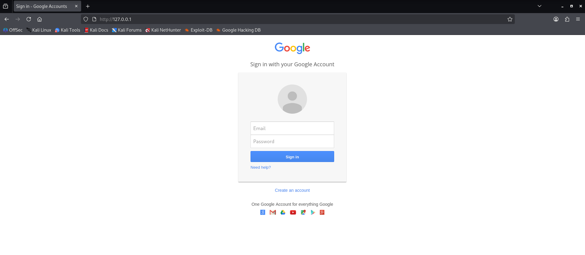
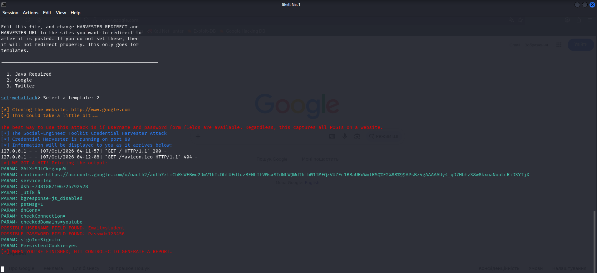

Запустив утиілт SEToolkit на Kali Linux та вибрав вектор веб-атак для розгортання фішингової атаки

У меню веб-атак обрав метод Credential Harvester для збору введених користувачем логінів та паролів

Вибрав використання готових веб-шаблонів та вказав локальну IP-адресу 127.0.0.1 для надсилання перехоплених даних

Обрав шаблон входу Google

Відкрив підроблену сторінку входу Google у браузері за адресою 127.0.0.1 та ввів логін і пароль.

У терміналі висвітилось успішне перехоплення введеного логіна student та пароля 123456

